# Flutter Assignment

A Flutter project containing 8 different assignments demonstrating various Flutter concepts and widgets.

## How to Use

This project contains 8 assignment tabs that you can navigate through to explore different Flutter implementations:

1. **Assignment 1** - Image Display (Asset & Network)
2. **Assignment 2** - Card Layout
3. **Assignment 3** - Interactive Counter with setState()
4. **Assignment 4** - Fun Packages Implementation
5. **Assignment 5** - BMI Calculator with Form Validation & Input Fields
6. **Assignment 6** - TMDB Movie App - API Integration
7. **Assignment 7** - Poképedia - Pokemon App with Lottie Animation
8. **Assignment 8** - [Description]

Simply click on any assignment tab to view its implementation and functionality.

## Screenshots

### Main Page
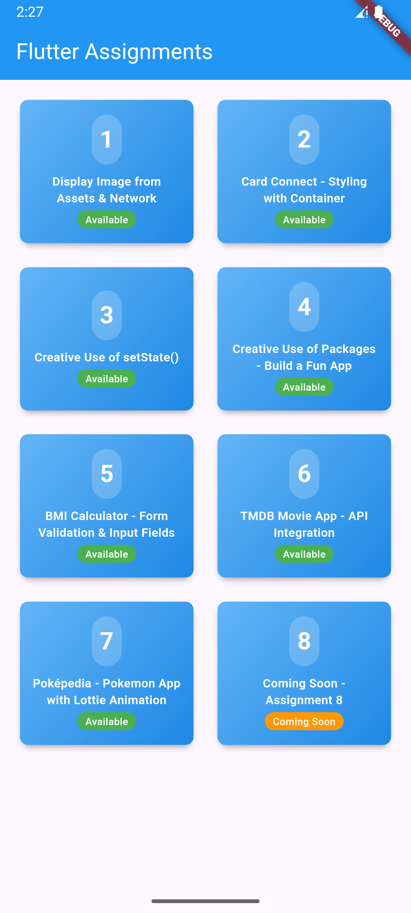

### Assignment 1 - Asset Image
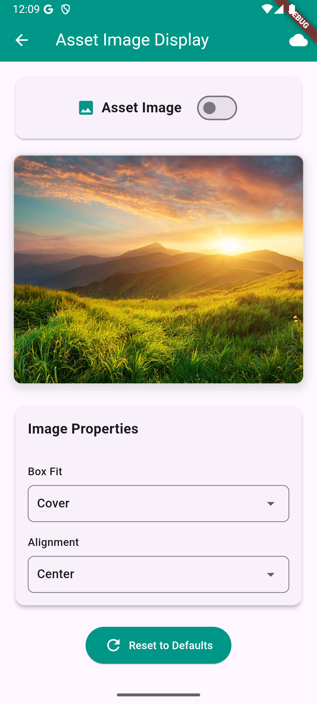

### Assignment 1 - Network Image
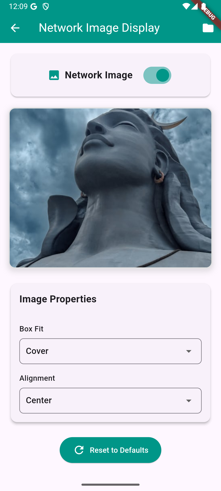

### Assignment 2 - Card Layout
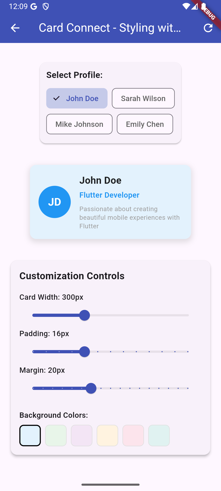

### Assignment 3
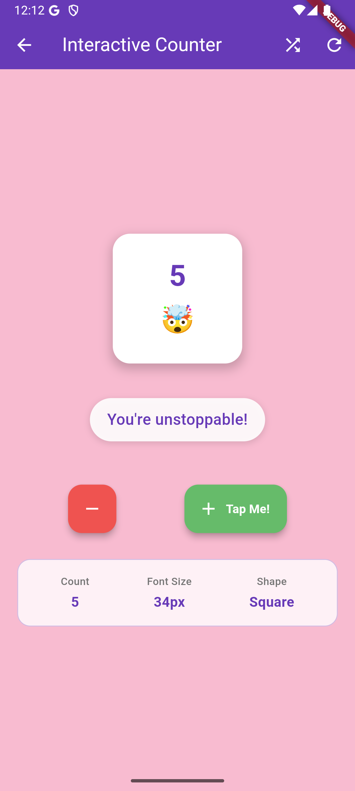

### Assignment 4
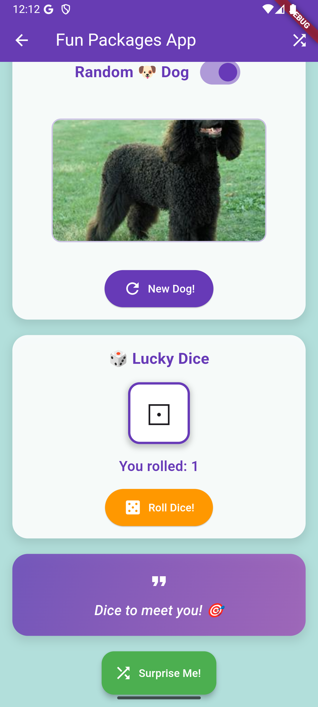

### Assignment 5 - BMI Calculator
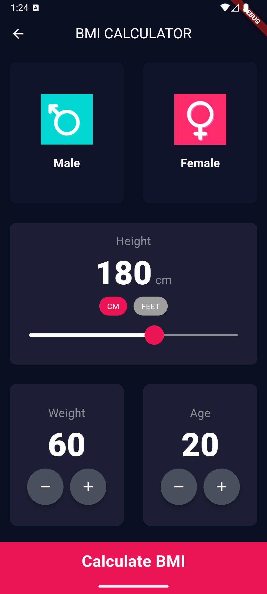
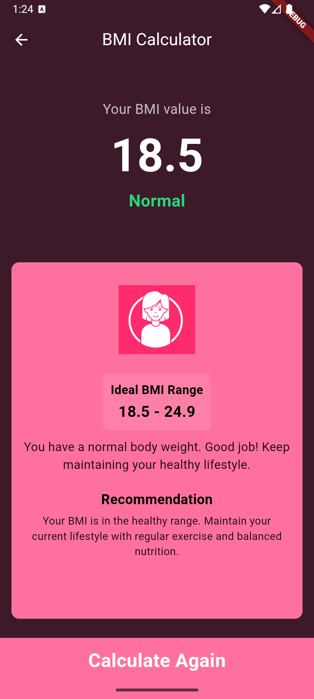

Features:
- Dynamic gender-based theming with icon color extraction
- Male theme: Teal (#4AE1DD) / Female theme: Pink (#FE719E)
- Gender selection with asset icons and background glow effects
- Height input with CM/Feet toggle and decimal precision for feet
- Weight and Age adjustment with +/- buttons
- Real-time BMI calculation with color-coded results
- Comprehensive results page with gender-specific images
- Ideal BMI range display and personalized recommendations
- Weight gain/loss suggestions with precise calculations
- Responsive design with overflow handling
- Enhanced text visibility on all background colors

### Assignment 6 - TMDB Movie App
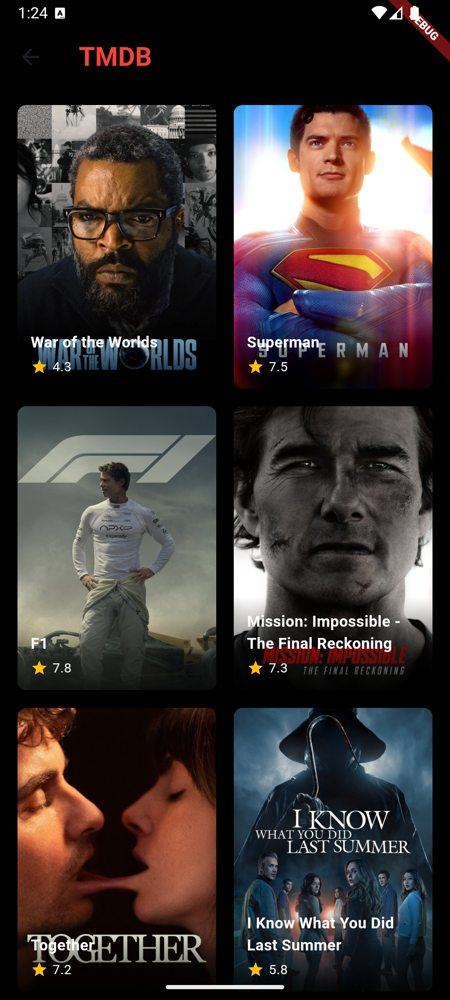
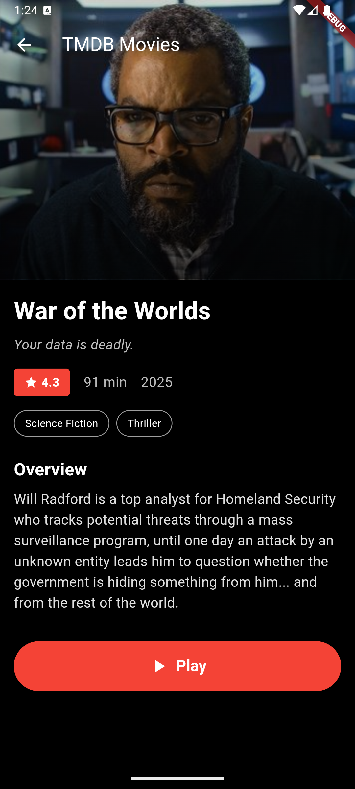

Features:
- Netflix-themed UI with black background and red accents
- TMDB API integration for fetching popular movies
- Grid layout displaying movie posters with ratings
- Detailed movie pages with backdrop images and comprehensive information
- Loading indicators and error handling with retry functionality
- Pull-to-refresh functionality for movie list
- Movie details including runtime, genres, release year, and overview
- Netflix-style play button and UI elements
- Responsive design with proper image error handling
- HTTP requests using the http package for REST API communication

### Assignment 7 - Poképedia - Pokemon App
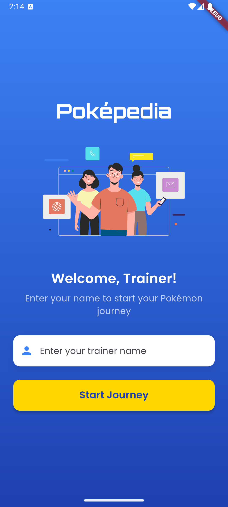
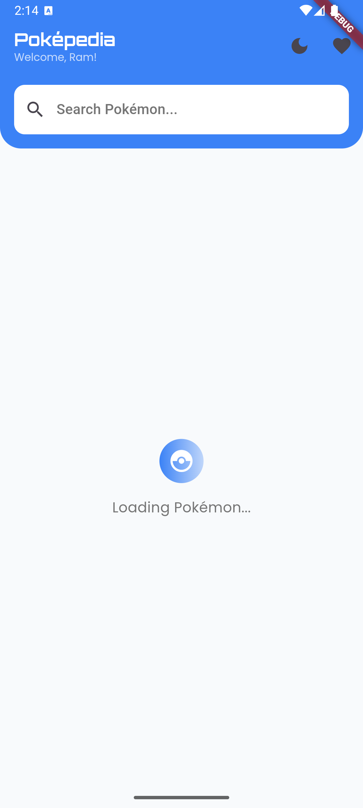
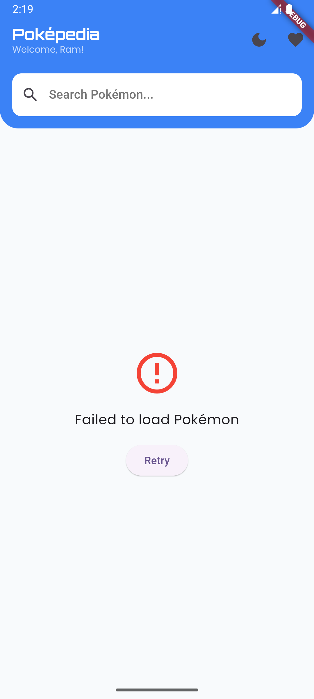
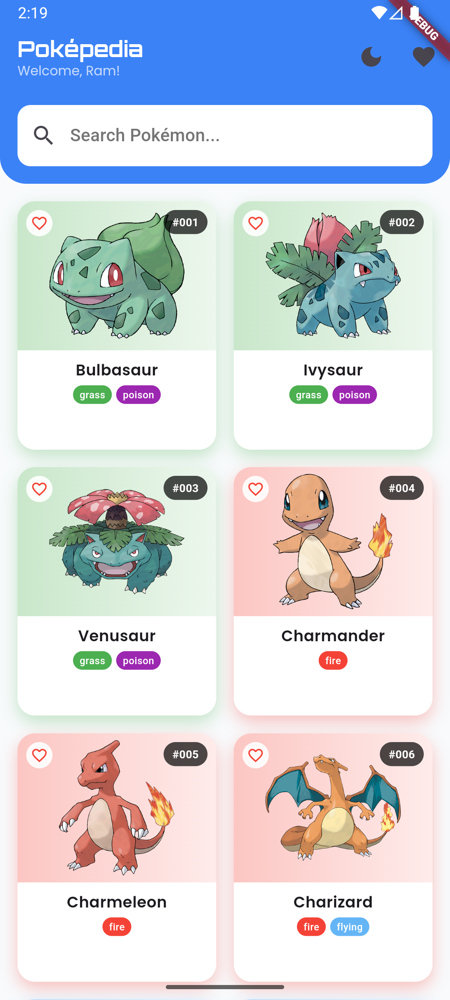
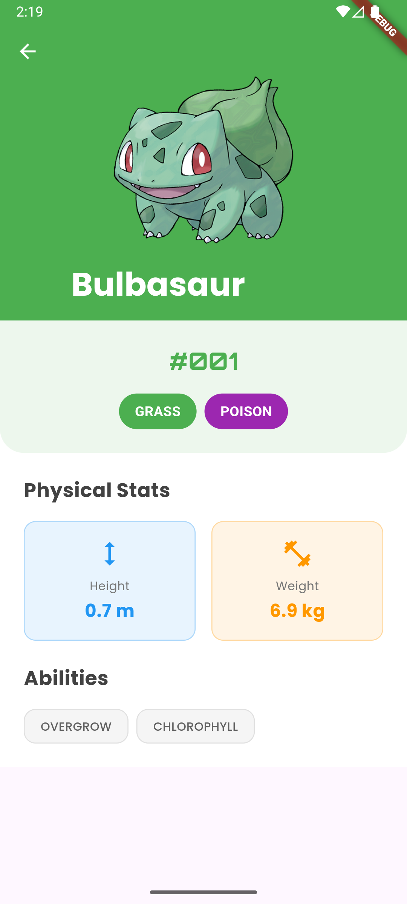

Features:
- Login screen with Lottie animation and trainer name input
- PokéAPI integration for fetching Pokemon data from official API
- Grid layout displaying Pokemon with images, names, types, and IDs
- Search functionality with real-time filtering by Pokemon name
- Dark mode toggle with complete UI theming support
- Favorite Pokemon system with heart icons and favorites dialog
- Detailed Pokemon pages with stats, abilities, and type information
- Type-based color theming with 18 different Pokemon type colors
- Custom animations including staggered card entry and page transitions
- Enhanced error handling with network connectivity detection
- Pull-to-refresh functionality and loading states
- Hero animations and smooth navigation between screens

## Getting Started

To run this project:

1. Ensure you have Flutter installed
2. Clone this repository
3. Run `flutter pub get` to install dependencies
4. Run `flutter run` to start the application
