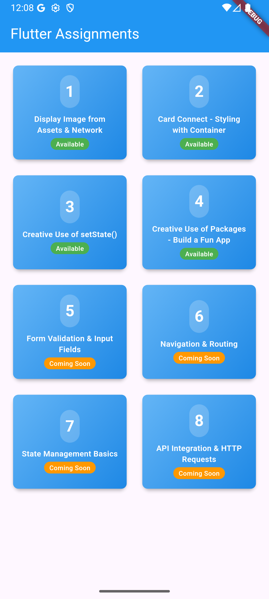

# Flutter Assignment

A Flutter project containing 8 different assignments demonstrating various Flutter concepts and widgets.

## How to Use

This project contains 8 assignment tabs that you can navigate through to explore different Flutter implementations:

1. **Assignment 1** - Image Display (Asset & Network)
2. **Assignment 2** - Card Layout
3. **Assignment 3** - [Description]
4. **Assignment 4** - [Description]
5. **Assignment 5** - [Description]
6. **Assignment 6** - [Description]
7. **Assignment 7** - [Description]
8. **Assignment 8** - [Description]

Simply click on any assignment tab to view its implementation and functionality.

## Screenshots

### Main Page

### Assignment 1 - Asset Image

### Assignment 1 - Network Image

### Assignment 2 - Card Layout

### Assignment 3

### Assignment 4

## Getting Started

To run this project:

1. Ensure you have Flutter installed
2. Clone this repository
3. Run `flutter pub get` to install dependencies
4. Run `flutter run` to start the application
